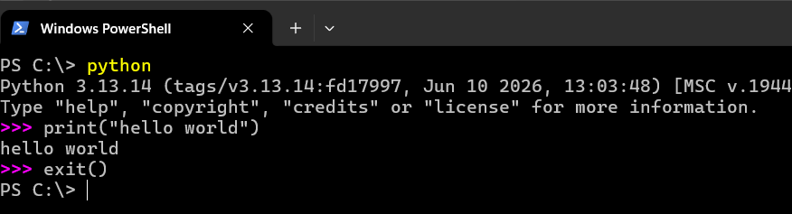
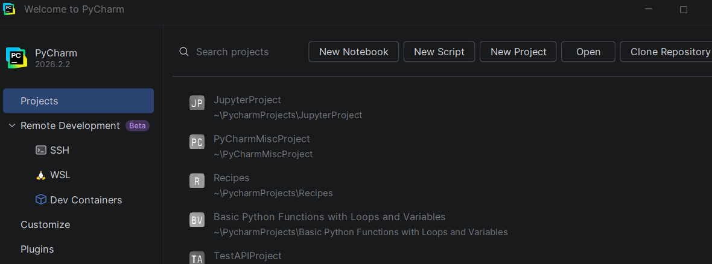
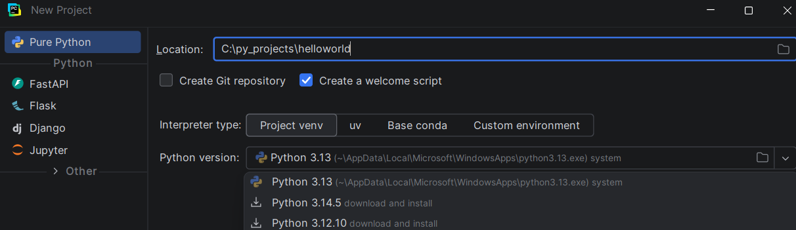
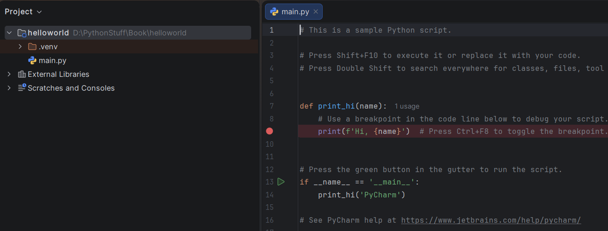
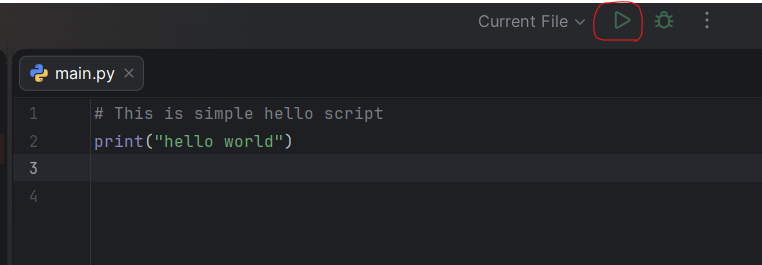
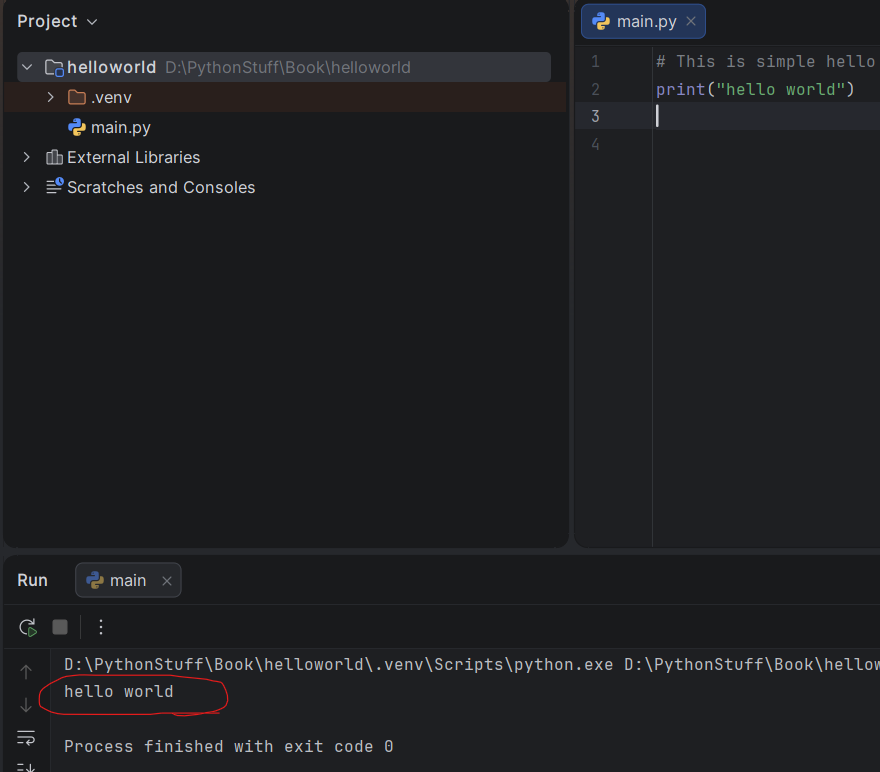
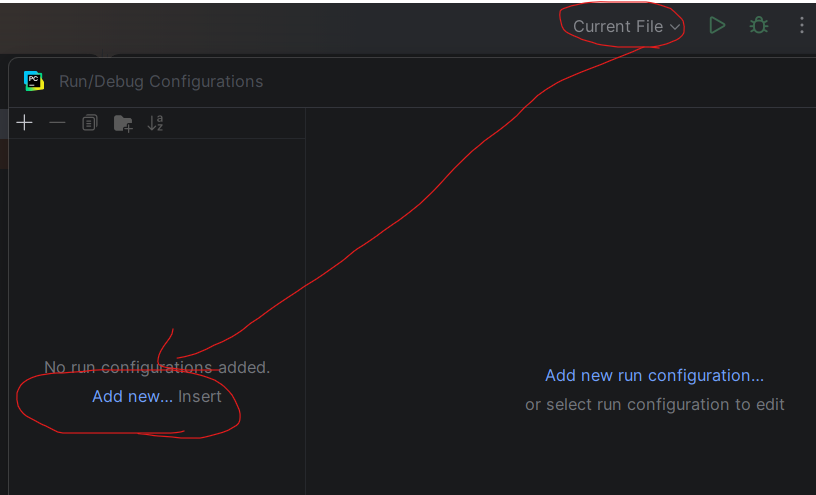
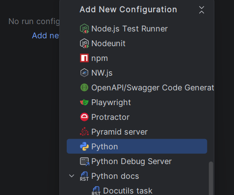
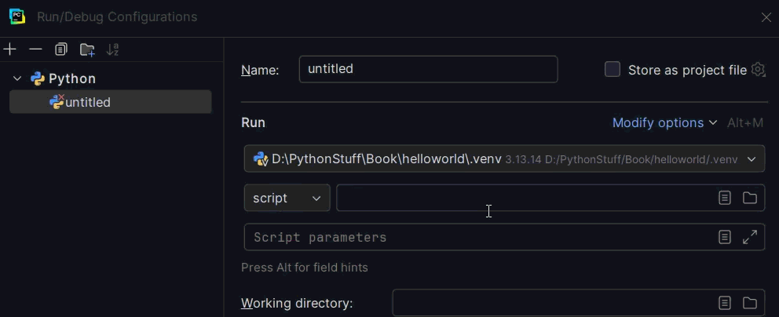

# First Steps

We will now see how to run a traditional 'Hello World' program in Python. This will teach you how to write, save and run Python programs.

There are two ways of using Python to run your program - using the interactive interpreter prompt or using a source file. We will now see how to use both of these methods.

## Using The Interpreter Prompt

Open the terminal in your operating system using:
 - Windows: pressing the Windows Key + R and typing `wt` then `[enter]`
     - Older windows: type `cmd` instead
 - Linux: Ctrl+Alt+T
 - MacOS: Command+Spacebar
 
Then open the Python prompt by typing `python3` or `python` and pressing `[enter]` key.

Once you have started Python, you should see `>>>` where you can start typing stuff. This is called the _Python interpreter prompt_.

At the Python interpreter prompt, type:

```python
print("Hello World")
```

followed by the `[enter]` key. You should see the words `Hello World` printed to the screen.

Here is an example of what you should be seeing, when using Windows 11. The details about the Python software will differ based on your computer, but the part from the prompt (i.e. from `>>>` onwards) should be similar regardless of the operating system.



Notice that Python gives you the output of the line immediately! What you just entered is a single Python _statement_. We use `print` to (unsurprisingly) print any value that you supply to it. Here, we are supplying the text `Hello World` and this is promptly printed to the screen.

### How to Quit the Interpreter Prompt

Entering `exit()` (note: remember to include the parentheses, `()`) followed by the `[enter]` key will exit the interpreter in any system. For MacOS or Linux, you can also exit the interpreter prompt by pressing `[ctrl + d]` (`[cmd + d]`) while for Windows you'd press `[ctrl + z]`.

## Choosing An Editor

We cannot type out our program at the interpreter prompt every time we want to run something, so we have to save them in files and can run our programs any number of times.

To create our Python source files, we need an editor software where you can type and save. A good programmer's editor will make your life easier in writing the source files. Hence, the choice of an editor is crucial indeed. You have to choose an editor as you would choose a car you would buy. A good editor will help you write Python programs easily, making your journey more comfortable and helps you reach your destination (achieve your goal) in a much faster and safer way.

One of the very basic requirements is _syntax highlighting_ where all the different parts of your Python program are colorized so that you can _see_ your program and visualize its running.

__New to Programming or Used to JetBrains__
If you are new to programming (or used to JetBrains products), I would recommend using [PyCharm's Community Edition](https://www.jetbrains.com/pycharm/) which is available on Windows, MacOS, and Linux. The standard version includes all the basic features you need while Pro is available for students and educators if you register for their [student pack](https://www.jetbrains.com/academy/student-pack/). Full details are in the next section.

__Used to VSCode__
It works perfectly fine for Python and they even provide a [pretty solid tutorial](https://code.visualstudio.com/docs/python/python-tutorial) for setting it up.

__Old hand at Emacs or Vim__
If you are an experienced programmer, then you must be already using [Vim](http://www.vim.org) or [Emacs](http://www.gnu.org/software/emacs/). Needless to say, these are two of the most powerful editors and you will benefit from using them to write your Python programs. I personally use both for most of my programs, and have even written an [entire book on Vim]({{ book.vimBookUrl }}).

In case you are willing to take the time to learn Vim or Emacs, then I highly recommend that you do learn to use either of them as it will be very useful for you in the long run. However, as I mentioned before, beginners can start with PyCharm and focus the learning on Python rather than the editor at this moment.

To reiterate, please choose a proper editor - it can make writing Python programs more fun and easy.

If you are interested in a detailed discussion on this topic, check out [Finding the Perfect Python Code Editor](https://realpython.com/courses/finding-perfect-python-code-editor/).

## PyCharm {#pycharm}

[PyCharm](https://www.jetbrains.com/pycharm/) is a free editor which you can use for writing Python programs. Note, when you set it up for the first time it will provide a Trial edition of Pro but once that expires you have 2 choices:
  - You can continue with the "Community" verison (less features)
  - If Student/Educator: You can apply for the [JetBrains Education License](https://www.jetbrains.com/academy/student-pack/) (to apply you merely need to sign in once approved)

When you open PyCharm, you'll see this, click on `New Project`:



Select `Pure Python` at the top:
Ensure you select `venv` and then either use the installed Python version or select a different version to have PyCharm install it locally.

Change location from the default to the location you want ending in `helloworld` and ensure you clicked you `create welcome script` option
You should see details similar to this:



Click the `Create` button.

As we created a Welcome Script we will already have a Python script ready to run



Delete the lines that are already present and either click on the red dot or hit `Ctrl+F8` to turn off the debugging breakpoint (more on that later). Then type the following:

```python
# This is simple hello script
print("hello world")
```

Now either hit `Shift+F10` or click on the Run button (Triangle pointing to right):



You should now see the output (what it prints) of your program:



Phew! That was quite a few steps to get started, but henceforth, every time we ask you to create a new file, remember to just ensure you select the `create welcome script` option and then clear out the sample text and remove the breakpoint so your ready to go.

You can find more information about PyCharm in the [PyCharm Quickstart](https://www.jetbrains.com/help/pycharm/quick-start-guide.html) page. The next section is only needed if command-line arguments are required (i.e. you want to run a script like `./check_file.py file=quarterly_sales.json` directly from PyCharm) - if you are just starting you can return here once that is required.

### PyCharm Command Line
To add command line arguments we have to add a configuration file (the default doesn't have it): 

To do so: click on `Current File` -> `Edit Configurations`->`add new...`:



Then scroll and select `Python` (as this is Pure Python):



Select your main Python file (click the folder next to the `script` field)



Then just change the `script parameters` field to include any arguments you want to send to the Python script.

## Vim

1. Install [Vim](http://www.vim.org)
    * MacOS users should install `macvim` package via [HomeBrew](http://brew.sh/)
    * Windows users should download the "self-installing executable" from [Vim website](http://www.vim.org/download.php)
    * Linux users should get Vim from their distribution's software repositories, e.g. Debian and Ubuntu users can install the `vim` package.
2. Install [jedi-vim](https://github.com/davidhalter/jedi-vim) plugin for autocompletion.
3. Install corresponding `jedi` python package : `pip install -U jedi`

## Emacs

1. Install [Emacs 24+](http://www.gnu.org/software/emacs/).
    * MacOS users should get Emacs from http://emacsformacosx.com
    * Windows users should get Emacs from http://ftp.gnu.org/gnu/emacs/windows/
    * Linux users should get Emacs from their distribution's software repositories, e.g. Debian and Ubuntu users can install the `emacs24` package.
2. Install [ELPY](https://github.com/jorgenschaefer/elpy/wiki)

## Using A Source File

Now let's get back to programming. There is a tradition that whenever you learn a new programming language, the first program that you write and run is the 'Hello World' program - all it does is just say 'Hello World' when you run it. As Simon Cozens[^1] says, it is the "traditional incantation to the programming gods to help you learn the language better."

Start your choice of editor, enter the following program and save it as `hello.py`.

If you are using PyCharm, we have already [discussed how to run from a source file](#pycharm).

For other editors, open a new file `hello.py` and type this:

```python
print("hello world")
```

Where should you save the file? To any folder for which you know the location of the folder. If you
don't understand what that means, create a new folder and use that location to save and run all
your Python programs:

- `/tmp/py` on MacOS
- `/tmp/py` on Linux
- `C:\py` on Windows

To create the above folder (for the operating system you are using), use the `mkdir` command in the terminal, for example, `mkdir /tmp/py`.

IMPORTANT: Always ensure that you give it the file extension of `.py`, for example, `foo.py`.

To run your Python program:

1. Open a terminal window (see the previous [Installation](./installation.md#installation) chapter on how to do that)
2. **C**hange **d**irectory to where you saved the file, for example, `cd /tmp/py`
3. Run the program by entering the command `python hello.py`. The output is as shown below.

```
$ python hello.py
hello world
```


If you got the output as shown above, congratulations! - you have successfully run your first Python program. You have successfully crossed the hardest part of learning programming, which is, getting started with your first program!

In case you got an error, please type the above program _exactly_ as shown above and run the program again. Note that Python is case-sensitive i.e. `print` is not the same as `Print` - note the lowercase `p` in the former and the uppercase `P` in the latter. Also, ensure there are no spaces or tabs before the first character in each line - we will see [why this is important](./basics.md#indentation) later.

**How It Works**

A Python program is composed of _statements_. In our first program, we have only one statement. In this statement, we call the `print` _statement_ to which we supply the text "hello world".

## Getting Help

If you need quick information about any function or statement in Python, then you can use the built-in `help` functionality. This is very useful especially when using the interpreter prompt. For example, run `help('len')` - this displays the help for the `len` function which is used to count number of items.

TIP: Press `q` to exit the help.

Similarly, you can obtain information about almost anything in Python. Use `help()` to learn more about using `help` itself!

In case you need to get help for operators like `return`, then you need to put those inside quotes such as `help('return')` so that Python doesn't get confused on what we're trying to do.

## Summary

You should now be able to write, save and run Python programs at ease.

Now that you are a Python user, let's learn some more Python concepts.

---

[^1]: the author of the amazing 'Beginning Perl' book
