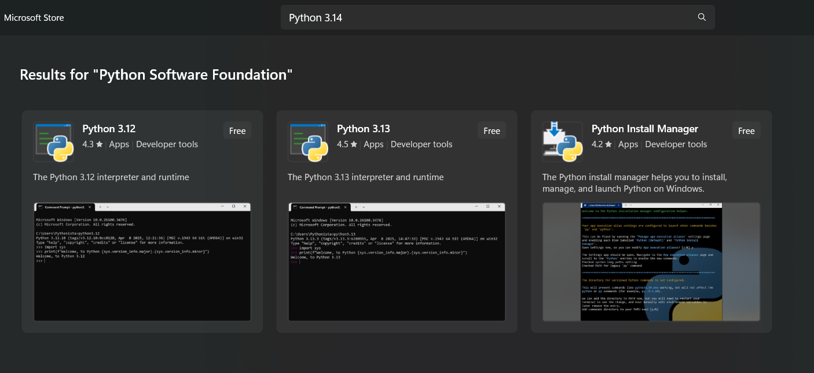
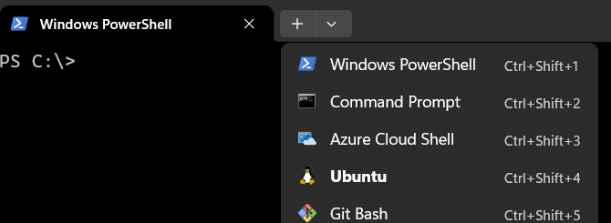

# Installation {#installation}

When we refer to "Python 3" in this book, we will be referring to any version of Python equal to or greater than version [Python {{ book.pythonVersion }}](https://www.python.org/downloads/).

Install instructions are included for:
  - [Windows](#installation-on-windows)
  - [Mac or Macbook](#installation-on-mac-or-macbook)
  - [Linux](#installation-on-linux)

## Installation on Windows
There are three methods for installing on Windows:
  1. [Use the Installer through the Microsoft (MS) Store](#ms-store)
  2. [Install a Linux Subsystem](#linux-subsystem)
  3. [Download the installer direct from the website](#website-install)

### MS Store
The simplest method of installing Python on Windows is to use the Microsoft (MS) Store and search for The Python Foundation


These may not be the latest version (at the time of this writing it was one behind the stable release) but will both install the full system, REPL, basic editor, pip, and set Python to your accounts path.

### Linux Subsystem
If using Python for Cybersecurity, Networking, or simply with Linux - installing a subsystem that allows access to Linux command line tools (including Python) might be a better option. You can directly install them with PowerShell by following the [instructions on this page](https://learn.microsoft.com/en-us/windows/wsl/install) or use the MS Store which includes a limited set of options. Currently, the options available through the MS Store include:

  - Kali Linux by Kali (typically used for Penetration Testing)
  - Ubuntu by The Canonical Group Limited (basic Linux system)
  - Debian by The Debian Project (light-weight system)

Once installed you can access them through your Terminal program (see [Windows Terminal](#windows-terminal) for help accessing it) - just open a tab to the subsystem you installed:



Then check your installation with one of the following (which depends on Linux version installed):

`python --version` or `python3 --version`
```
$ python --version
Python 3.14.7
```

### Website Install
By using the website [https://www.python.org/downloads/](https://www.python.org/downloads/) it ensures you can always install the latest version which, at the time of this writing, was Python 3.14.7.
The installation is just like any other Windows-based software downloaded from a website.

CAUTION: Make sure you check option `Add Python 3.14 to PATH`.

To change install location, click on `Customize installation`, then `Next` and enter `C:\Python314` or `C:\Users\YourUsername\Python314` (or another appropriate location) as the install location.

If you didn’t check the `Add Python 3.14 PATH` option earlier, check `Add Python to environment variables`. This does the same thing as `Add Python 3.14 to PATH` on the first install screen.

You can choose to install Launcher for all users or not, it does not matter much. Launcher is used to switch between different versions of Python installed.

If your path was not set correctly (by checking the `Add Python 3.14 Path` or `Add Python to environment variables` options), then follow the steps in the next section (`Windows Terminal`) to fix it. Otherwise, go to the `Running Python prompt on Windows` section in this document.

NOTE: For people who already know programming, if you are familiar with Docker, check out [Python in Docker](https://hub.docker.com/_/python/) and [Docker on Windows](https://docs.docker.com/windows/).

### Set Path Variable

The easiest way to open Terminal is just to use the Search bar and type `Terminal`. You can also use `Command Prompt` with older versions of Windows.

**For Windows 11:**

Click on the Search Bar (magnifying glass) next to the Windows Start Menu
Type `Environmental Variables` and select `Change Environmental Variables for Your Account`
Select `Path` and click `Edit`
`New` > (type in whatever your python location is.  For example, `C:\Python314\`)

**For Windows 10:**

Windows Start Menu > `Settings` > `About` > `System Info` (this is all the way over to the right) > `Advanced System Settings` > `Environment Variables` (this is towards the bottom) > (then highlight `Path` variable and click `Edit`) > `New` > (type in whatever your python location is.  For example, `C:\Python314\`)

### Windows Terminal

For Windows users, you can run the interpreter in the command line if you installed it using the MS Store or set the path variable during the direct installation. If not see the [set the `PATH` variable](#set-path-variable) section for how to manually set it.

To open the terminal in Windows, click the start button and type `terminal` then select and open it. 
You can also search for `cmd` in older versions then select `command prompt` and open it.

Then, type `python` and ensure there are no errors.

## Installation on Mac or Macbook

For MacOS users, use [Homebrew](http://brew.sh): `brew install python3`.

To verify, open the terminal by pressing `[Command + Space]` keys (to open Spotlight search), type `Terminal` and press `[enter]` key. Now, run `python3` and ensure there are no errors.

## Installation on Linux

For GNU/Linux users, use your distribution's package manager to install Python 3, e.g. on Debian & Ubuntu: `sudo apt-get update && sudo apt-get install python3`.

To verify, open the terminal by opening the `Terminal` application or by pressing `Alt + F2` and entering `gnome-terminal`. If that doesn't work, please refer the documentation of your particular GNU/Linux distribution. Now, run `python3` or `python` and ensure there are no errors.

You can see the version of Python on the screen by running `python --version` or `python3 --version`

```
$ python --version
Python 3.14.0
```

NOTE: `$` is the prompt of the shell. It will be different for you depending on the settings of the operating system on your computer, hence I will indicate the prompt by just the `$` symbol.

CAUTION: Output may be different on your computer, depending on the version of Python software installed on your computer.

## Summary

From now on, we will assume that you have Python installed on your system.

Next, we will write our first Python program.
